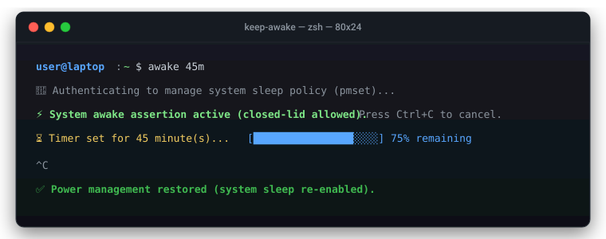

# keep-awake ⚡

```text
 _  __ ___ ___ ___        _ __      __  _   _  _____ 
| |/ /| __| __| _ \ ___  / \\ \    / / /_\ | |/ / __|
| ' < | _|| _||  _/|___|/ _ \\ \/\/ / / _ \| ' <| _|  
|_|\_\|___|___|_|      /_/ \_\\_/\_/ /_/ \_\_|\_\___|
```

> Minimal, zero-bloat CLI to keep your laptop awake (even with lid closed) on macOS and Linux.

[](https://opensource.org/licenses/MIT)
[](https://www.gnu.org/software/bash/)
[](https://github.com/r1cc4rd0m4zz4/keep-awake/actions/workflows/ci.yml)
[](#security--quality-gates)
[](#how-it-works)

<p align="center">
  
</p>

`keep-awake` (or simply `awake`) is a transparent, lightweight command-line tool that prevents system sleep, screen sleep, and clamshell/lid-closed sleep without background daemons, accessibility hooks, or sudoers tampering.

---

## Why keep-awake?

Many existing tools (like Capsomnia or Amphetamine) require:
* ⚠️ **Accessibility permissions:** granting global keyboard event taps (`CGEventTap`).
* ⚠️ **Privilege escalation holes:** writing permanent `NOPASSWD` rules into `/etc/sudoers`.
* ⚠️ **Background daemons:** running `LaunchAgents` 24/7 in memory.
* ⚠️ **Heavy frameworks:** bloated GUI wrappers or third-party auto-updater daemons.

`keep-awake` takes the native, zero-bloat approach:
* ✅ **Zero daemons:** runs only when you invoke it, cleans up, and exits.
* ✅ **Zero sudoers tampering:** uses standard temporary `sudo` on macOS and unprivileged `systemd-inhibit` on Linux.
* ✅ **Zero accessibility hooks:** no keyboard monitoring, zero keylogging risk.
* ✅ **Guaranteed cleanup:** uses POSIX `trap` to re-enable normal sleep as soon as the timer expires or `Ctrl+C` is pressed.
* ✅ **Battery warning:** alerts you if running on battery below 15%.
* ✅ **Zero third-party dependencies:** 100% auditable native Bash script.

---

## The Philosophy

1. **The Ladder of Restraint (Native Platform First):**  
   If the operating system already solves a problem (`pmset`, `systemd-inhibit`), writing custom daemons, LaunchAgents, or GUI wrappers is not innovation—it is technical debt.
2. **Code You Know, Not Code You Trust (Digital Sovereignty):**  
   True security is never about blind trust in a developer's certificate, promises, or closed binary. It is about code you can audit yourself in 60 seconds before running it.
3. **Hardware Ethics:**  
   Software does not run in a vacuum; it runs on lithium-ion chemistry and silicon. We prioritize thermal safety and battery longevity over brute-force overrides.

---

## Installation

### Option 1: One-liner (Remote)

```bash
curl -fsSL https://raw.githubusercontent.com/r1cc4rd0m4zz4/keep-awake/main/install.sh | bash
```

### Option 2: From Local Clone

```bash
git clone https://github.com/r1cc4rd0m4zz4/keep-awake.git
cd keep-awake
./install.sh
```

The installer places `keep-awake` and an `awake` shorthand symlink into `~/.local/bin/`.

Ensure `~/.local/bin` is in your `$PATH`:
```bash
export PATH="$HOME/.local/bin:$PATH"
```

### Option 3: Zero-Install (Pure Shell Function)

If you prefer not to install any binary or curl script, add this function directly to your `~/.zshrc` or `~/.bashrc`:

```bash
awake() {
    local mins="${1:-60}"
    if [[ "$OSTYPE" == "darwin"* ]]; then
        echo "🔐 Authenticating (pmset)..."
        sudo pmset -a disablesleep 1
        trap 'sudo pmset -a disablesleep 0; echo -e "\n✅ Sleep re-enabled."; trap - INT TERM EXIT' INT TERM EXIT
        echo "⚡ Awake for $mins minute(s) (Ctrl+C to abort)..."
        sleep "$((mins * 60))"
    else
        systemd-inhibit --what="idle:sleep:handle-lid-switch" --who="awake" --why="User keep-awake" sleep "$((mins * 60))"
    fi
}
```

---

## Usage

```bash
# Keep awake for the default duration (60 minutes)
awake

# Specify custom duration (supports h, m, s)
awake 45m
awake 2h
awake 3600s

# Keep awake only for the duration of a command or script
awake -c "npm run build"
awake -c "python train_model.py"

# Stop anytime
Press Ctrl + C
```

---

## How It Works

### macOS
* Invokes Apple's native `/usr/bin/pmset -a disablesleep 1` command to prevent all sleep modes (including closed-lid clamshell without an external display).
* **Why sudo?** Apple requires root privileges to alter global power policy via `pmset`. Unlike tools that write permanent `NOPASSWD` rules into `/etc/sudoers`, `keep-awake` requests standard temporary authentication only when you run it.
* Registers a `trap` for `INT`, `TERM`, and `EXIT` signals to atomically restore `/usr/bin/pmset -a disablesleep 0`.

### Linux
* Uses `systemd-inhibit --what="idle:sleep:handle-lid-switch"`.
* Requires **no root privileges** on modern systemd/logind distributions (Ubuntu, Debian, Fedora, Arch, etc.).
* Releases the inhibitor lock automatically upon exit.

### Battery & Power Fail-safe
Even with sleep disabled, both macOS and Linux kernel hardware monitors enforce emergency power-off if the battery reaches critical 0% state, preventing hardware damage. For long tasks, keeping the power adapter plugged in is strongly recommended.

---

## Hardware & Thermal Notice

⚠️ **Do NOT place your laptop inside a backpack or enclosed bag while `keep-awake` is active with the lid closed.** Laptops require adequate ventilation to dissipate heat; running intensive workloads in an enclosed space can cause thermal throttling or battery degradation.

---

## Uninstallation

```bash
# Using the installer
./install.sh --uninstall

# Or manually
rm -f ~/.local/bin/keep-awake ~/.local/bin/awake
```

---

## Scope & Non-Goals

To preserve zero-bloat integrity, `keep-awake` has strict non-goals:
* ❌ **No Menu Bar / GUI:** If you want desktop widgets and animations, use Amphetamine.
* ❌ **No Resident Daemons:** `keep-awake` will never install background services. It runs, holds the assertion, and exits cleanly.
* ❌ **No Third-Party Dependencies:** It will forever remain a self-contained, auditable Bash script.

---

## Security & Quality Gates

This repository adheres to strict defensive security engineering:
* **Zero Third-Party Dependencies:** No `node_modules`, no pip packages, no external binary blobs. Zero supply-chain attack surface.
* **Static Analysis:** Automated `shellcheck` with zero tolerated warnings on all scripts.
* **Secret Detection:** Automated `gitleaks` scanning on every push and pull request.
* **Regression Testing:** Automated multi-platform test suite (`tests/test_suite.sh`) executing on macOS and Linux runners.

---

## Contributors & Authors

<p align="left">
  <a href="https://github.com/r1cc4rd0m4zz4">
    
  </a>
</p>

* **r1cc4rd0m4zz4** ([@r1cc4rd0m4zz4](https://github.com/r1cc4rd0m4zz4))  
  *Cybersecurity Specialist & Anti-Bloat Architect.*

See also [CONTRIBUTORS.md](CONTRIBUTORS.md) for contribution guidelines.

---

## License

MIT License © 2025 r1cc4rd0m4zz4
